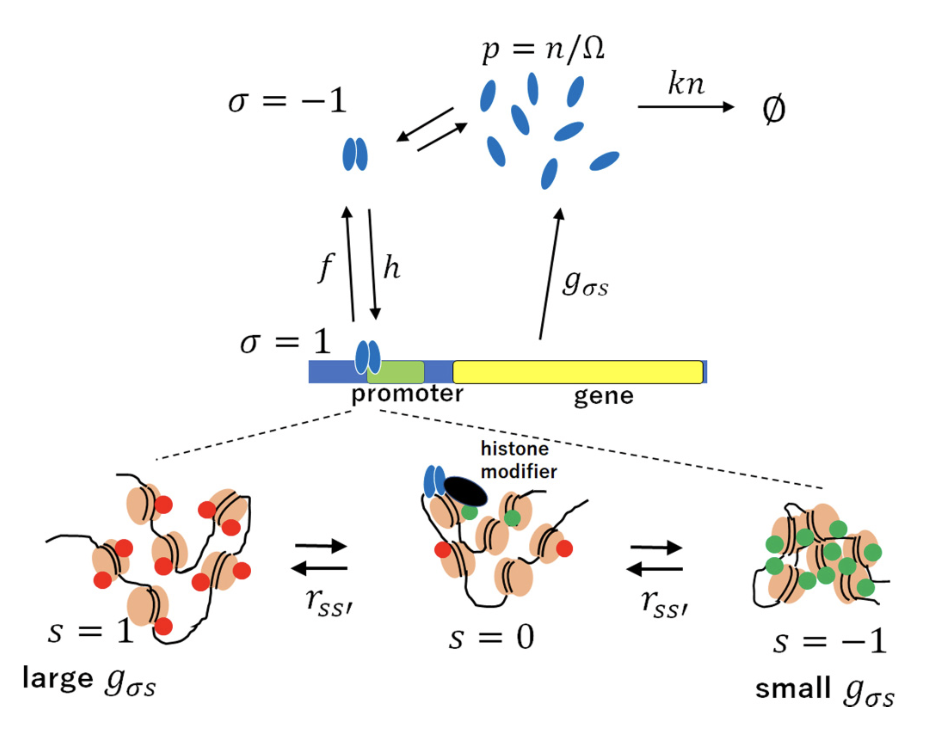

# Stochastic Epigenetic Dynamics of Gene Switching

- A small study project about the homonymous paper from Bhattacharyya, Wang and Sasai. What follows is the theoretical derivation upon which the simulations in the jupyter notebook are based.

Graphical summary of the system. Image taken from the paper

- We define the probability of having a protein copy number $n$ in a state $\sigma s$ for the histone and the transcription factor as $\Psi_{\sigma s}(t) = \sum_n P_{\sigma s}(n,t)|n\rangle$
- Defining $a^\dagger,a$ as $a^\dagger|n\rangle=|n+1\rangle$ and $a|n\rangle=n|n-1\rangle$ we have:
    - $[a,a^\dagger]=1$
    - $\langle n|a|n+1\rangle = \langle n|n\rangle(n+1) = \langle n+1|n+1\rangle \to \langle n|n\rangle = n!$
    - $\langle n-1|n\rangle = \langle n-1|(aa^\dagger-a^\dagger a)|n\rangle= n\langle n-1|n\rangle-n\langle n-1|n\rangle = 0$
        - $\langle n|m\rangle=\delta_{nm}n!$
- Assuming all reaction are Markovian, the evolution of $\Psi(t)$ is given in the form
$\frac{\partial}{\partial t}\Psi(t) = -H\Psi(t)$
with $H = k(a^\dagger a-a)\mathbb{I} + G(1-a^\dagger) - J\otimes K$
and where $\mathbb{I},G,J\otimes K$ are six-dimensional matrices acting on $\sigma,s$ spaces. In particular $G,J\otimes K$ contain the transition rates (all definitions in the paper) and the latter is short for $J\otimes \mathbb{I} + \mathbb{I}\otimes K$.
The production rate of the protein $g_{\sigma s}$ is contained in $G$, while $f,h$ are in $J$ and $r_{ss'}$ in $K$. Notice that $h=h_0(a^\dagger a)^2$ has a dependence on the protein population and $r=r^0+\delta_{1\sigma}\Delta r$ has a dependence on the TF state.
- We could observe now in $\Psi_{\sigma s}(t) = \sum_n P_{\sigma s}(n,t)|n\rangle$ that $P_{\sigma s}(n,t) = P^{(1)}_{\sigma s}(t) \otimes P^{(2)}(n,t)$. From this we can switch to a coherent-states representation, with the aim of switching from a discrete space to a continuous one, to be exploited in the path integral formalism (specifically, to write resolutions of the identity):
    - $\sum_n P^{(2)}(n,t)|n\rangle \to |z\rangle = e^{za^\dagger}|0\rangle=\sum_n\frac{z^n}{n!}a^{\dagger^n}|0\rangle=\sum_n\frac{z^n}{n!}|n\rangle$ with $z(t) = \psi e^{-i\chi}$
        - $\langle z| := e^{z^*a}$ where $z^*=e^{i\chi}\ne\bar{z}=\psi e^{i\chi}$
        - $\to \langle z|z\rangle = \sum_n\frac{z^{*^n}}{n!}\langle n|\sum_m\frac{z^m}{m!}|m\rangle = \sum_n\frac{\psi^n}{n!} = e^\psi$
        - $a|z\rangle = z|z\rangle$ and $\langle z|a^\dagger=\langle z|z^*$
            - Proof:
                
                $$
                \begin{split}
                a|z\rangle &= \sum_{n=0} \frac{z^n}{n!}a|n\rangle = \underset{=0}{a|0\rangle} + \sum_{n=1} \frac{z^n}{n!}n|n-1\rangle = z\sum_{n=1} \frac{z^{n-1}}{(n-1)!}|n-1\rangle \\
                &= z|z\rangle
                \end{split}
                $$
                
        - $\langle n|a^\dagger a|n\rangle=n\langle n|n\rangle \leftrightarrow \langle z|a^\dagger a|z\rangle = \psi\langle z|z\rangle$ so $\psi$ may be seen as the continuum version of $n$ which can represent the distribution of the protein populations given by $|z\rangle$. In order to have a faithful representation in this continuum limit we need to work in the assumption of $n$ large. In this way we have also
        $\langle z|(a^\dagger a)^2|z\rangle = z^*z\langle z|aa^\dagger|z\rangle = \psi\langle z|(1+a^\dagger a)|z\rangle = \psi(1+\psi)\langle z|z\rangle \simeq \psi^2 \langle z|z\rangle$
        in a way corresponding to $\langle n|(a^\dagger a)^2|n\rangle=n^2\langle n|n\rangle$
    - $P^{(1)}_{\sigma s}(t) = \sigma(\theta(t),\phi(t))\otimes s(\alpha(t),\beta(t))$, using spin representation, becomes
        - $\sigma = e^{i\phi/2}\cos^2\frac{\theta}{2}(1,0)^T + e^{-i\phi/2}\sin^2\frac{\theta}{2}(0,1)^T$ where $(x,y)=(\delta_{\sigma 1},\delta_{\sigma -1})$
        $\tilde{\sigma} = e^{-i\phi/2} (1,0) + e^{i\phi/2}(0,1)$
        - $s = e^{i\beta}\cos^4\frac{\alpha}{2}(1,0,0)^T + 2\cos^2\frac{\alpha}{2}\sin^2\frac{\alpha}{2}(0,1,0)^T + e^{-i\beta}\sin^4\frac{\alpha}{2}(0,0,1)^T$
        where $(x,y,z)=(\delta_{s 1},\delta_{s 0},\delta_{s -1})$
        $\tilde{s} = e^{-i\beta}(1,0,0) + (0,1,0) + e^{i\beta}(0,0,1)$
- So now we can exploit these coherent states form to rewrite the transition probability
$P(n_f,\tau|n_i,0) = \frac{1}{n_f!} \langle n_f|\exp (-\int_0^\tau H dt)|n_i\rangle$
as a path integral, where in the probability the $\sigma$ and $s$ components of initial and final states are understood. We later indicate with $|x\rangle := \sigma \otimes s \otimes |z\rangle$
- To do so we exploit the following resolutions of the identity $\mathbb{I} = \mathbb{I}_z \otimes \mathbb{I}_\sigma \otimes \mathbb{I}_s$
$\mathbb{I}_z = \frac{1}{2\pi}\int_0^\infty e^{-\psi}d\psi\int_{-\pi}^\pi d\chi |z\rangle\langle z|$
$\mathbb{I}_\sigma = \frac{1}{2\pi}\int_0^\pi\sin\theta d\theta\int_0^{2\pi}d\phi \,\,\sigma\tilde{\sigma}$
$\mathbb{I}_s = \frac{3}{4\pi}\int_0^\pi\sin\alpha d\alpha\int_0^{2\pi}d\beta \,\,s\tilde{s}$
    - Proof:
        
        $$
        \begin{split}
        \mathbb{I}_z|z'\rangle &= \frac{1}{2\pi}\int_0^\infty e^{-\psi}d\psi\int_{-\pi}^\pi d\chi\, |z\rangle\langle z|z'\rangle \\
        &=\frac{1}{2\pi} \int_0^\infty e^{-\psi}d\psi\int_{-\pi}^\pi d\chi \sum_{n,m,k} \frac{z^n|n\rangle}{n!}\frac{z^{*^m}\langle m|}{m!}\frac{z'^k|k\rangle}{k!} \\
        &= \frac{1}{2\pi} \int_0^\infty e^{-\psi}d\psi\int_{-\pi}^\pi d\chi \sum_{n,m} \frac{z^n|n\rangle}{n!}\frac{(z^*z')^m}{m!} \\
        &= \frac{1}{2\pi}\sum_{n,m}\frac{z'^m}{m!}\frac{|n\rangle}{n!}\int_0^\infty e^{-\psi}d\psi\int_{-\pi}^\pi d\chi\,\, z^nz^{*^m} \\
        &= \frac{1}{2\pi}\sum_{n,m}\frac{z'^m}{m!}\frac{|n\rangle}{n!}\int_0^\infty e^{-\psi}\psi^nd\psi\int_{-\pi}^\pi d\chi\,\, e^{i\chi(m-n)} \\
        &= \frac{1}{2\pi}\sum_{n,m}\frac{z'^m}{m!}\frac{|n\rangle}{n!}\,\Gamma(n+1)\,2\pi\delta_{mn} \\
        &=|z'\rangle
        \end{split}
        $$
        
        $$
        \begin{split}
        \mathbb{I}_\sigma &= \frac{1}{2\pi}\int_0^\pi\sin\theta \,d\theta\int_0^{2\pi}d\phi \,\,\sigma\tilde{\sigma} = \frac{1}{2\pi}\int_0^\pi\sin\theta \,d\theta\int_0^{2\pi}d\phi \,\, \begin{pmatrix}
        \cos^2\frac{\theta}{2} & 0 \\
        0 & \sin^2\frac{\theta}{2} \\
        \end{pmatrix} \\
        &= \int_0^\pi d\theta\sin\theta \begin{pmatrix}
        \cos^2\frac{\theta}{2} & 0 \\
        0 & \sin^2\frac{\theta}{2} \\
        \end{pmatrix} = 
        \int_0^\pi d\theta\sin\theta \begin{pmatrix}
        \frac{1+\cos\theta}{2} & 0 \\
        0 & \frac{1-\cos\theta}{2} \\
        \end{pmatrix} =
        \begin{pmatrix}
        1 & 0 \\
        0 & 1 \\
        \end{pmatrix}
        \end{split}
        $$
        
        $$
        \begin{split}
        \mathbb{I}_s &= \frac{3}{4\pi}\int_0^\pi\sin\alpha \,d\alpha\int_0^{2\pi}d\beta \,\,s\tilde{s} \\
        &= \frac{3}{4\pi}\int_0^\pi\sin\alpha \,d\alpha\int_0^{2\pi}d\beta \,\, \begin{pmatrix}
        \cos^4\frac{\alpha}{2} & 0 & 0 \\
        0 & 2\cos^2\frac{\alpha}{2}\sin^2\frac{\alpha}{2} & 0 \\
        0 & 0 & \sin^4\frac{\alpha}{2} \\
        \end{pmatrix} \\
        &= \frac{3}{2}\int_0^\pi d\alpha\sin\alpha \begin{pmatrix}
        \cos^4\frac{\alpha}{2} & 0 & 0 \\
        0 & 2\cos^2\frac{\alpha}{2}\sin^2\frac{\alpha}{2} & 0 \\
        0 & 0 & \sin^4\frac{\alpha}{2} \\
        \end{pmatrix} \\
        &= \frac{3}{2}\int_0^\pi d\alpha\sin\alpha \begin{pmatrix}
        (\frac{1+\cos\alpha}{2})^2 &0&0 \\
        0 & 2(\frac{1+\cos\alpha}{2})(\frac{1-\cos\alpha}{2}) & 0 \\
        0&0& (\frac{1-\cos\alpha}{2})^2 \\
        \end{pmatrix} \\
        &= \begin{pmatrix}
        1 & 0 & 0 \\
        0 & 1 & 0 \\
        0 & 0 & 1 \\
        \end{pmatrix} \\
        \end{split}
        $$
        
- For brevity we will subsequently indicate $\mathbb{I} =: \int dx |x\rangle\langle x|$,
$dx=e^{-\psi}\sin\theta\sin\alpha\,d\psi\, d\chi\, d\theta\, d\phi\, d\alpha\, d\beta$
- Then the transition probability can be rewritten in a path integral form by splitting $\tau$ in $N$ small intervals $\Delta t$, inserting the previous identities and finally taking the limit $N\to\infty$. In what follows the indices indicates the evaluation time $H_n:=H(t_n)$

$$
\begin{split}
P(n_f,\tau|n_i,0) &= \frac{1}{n_f!} \langle n_f|\exp\left(-\int_0^\tau H(t) dt\right)|n_i\rangle \\
&= const \cdot\langle n_f|\exp\left(-\int_{t_{N-1}}^{\tau}Hdt - \ldots-\int_{t_1}^{t_2}Hdt -\int_0^{t_1}Hdt\right)|n_i\rangle \\
&\simeq const\cdot\langle n_f|(1-H_N\Delta t)\ldots(1-H_1\Delta t)|n_i\rangle \\
&= const\cdot\langle n_f|(1-H_N\Delta t)\mathbb{I}(1-H_{N-1}\Delta t)\ldots(1-H_1\Delta t)|n_i\rangle \\
&= const\cdot\langle n_f|(1-H_N\Delta t)\int dx_N|x_N\rangle\langle x_N|(1-H_{N-1}\Delta t)\ldots|n_i\rangle \\
&= const\cdot\int\prod_{j=1}^{N-1}dx_j \langle x_{j+1}|(1-H_j\Delta t)|x_j\rangle \\
%&\overset{(a)}{=} const\cdot\int\prod_{j=1}^{N-1}dx_j \langle x_{j+1}|x_j\rangle e^{-\tilde{H_j}\Delta t}
\end{split}
$$

$$
\begin{split}
\langle x_{j+1}|&H_j|x_j\rangle = \\
&= k(\tilde{\sigma}_{j+1}\sigma_j)(\tilde{s}_{j+1}s_j)\langle z_{j+1}|a^\dagger a -a|z_j\rangle + (\tilde{\sigma}_{j+1}\tilde{s}_{j+1})G(\sigma_js_j)\langle z_{j+1}|1 -a^\dagger|z_j\rangle \\ 
&\qquad- [(\tilde{\sigma}_{j+1}J\sigma_j)\tilde{s}_{j+1}s_j+\tilde{\sigma}_{j+1}\sigma_j(\tilde{s}_{j+1}Ks_j)]\langle z_{j+1}|z_j\rangle \\
&=\langle z_{j+1}|z_j\rangle[k(\tilde{\sigma}_{j+1}\sigma_j)(\tilde{s}_{j+1}s_j)(z_{j+1}^*z_j-z_j) + (\tilde{\sigma}_{j+1}\tilde{s}_{j+1})G(\sigma_js_j)(1-z_{j+1}^*) \\
&\qquad- [(\tilde{\sigma}_{j+1}J\sigma_j)\tilde{s}_{j+1}s_j+\tilde{\sigma}_{j+1}\sigma_j(\tilde{s}_{j+1}Ks_j)]] \\

&=: \langle z_{j+1}|z_j\rangle \tilde{H}_j 
=\langle x_{j+1}|x_j\rangle \frac{\tilde{H}_j}{(\tilde{\sigma}_{j+1}\sigma_j)(\tilde{s}_{j+1}s_j)} \\

&\to\langle x_{j+1}|(1-H_j\Delta t)|x_j\rangle = \langle x_{j+1}|x_j\rangle \left(1- \frac{\tilde{H}_j}{(\tilde{\sigma}_{j+1}\sigma_j)(\tilde{s}_{j+1}s_j)}\Delta t\right) %\simeq
%\langle x_{j+1}|x_j\rangle e^{-\tilde{H_j}\Delta t}\qquad (a)
\end{split}

$$

- We shall notice that $J$ actually contains also the TF binding rate $h$ which depends on the protein concentration through the application of the number operator. Hence in the step above is understood that $J$ after application to $\langle z_{j+1}|$ has $h$ substituted with $h_0\psi^2/\Omega^2$. In the same way $K$ acts on $\sigma$ through $r_{ss'}=r^0_{ss'}+\delta_{\sigma1}\Delta_{ss'}$ which effectively yield a transition rate $r_{ss'}=r^0_{ss'}+\cos^2\frac{\theta}{2}\Delta_{ss'}$. Now we explicit the terms in $\tilde{H}_j$:

$$
\begin{split}
\tilde{\sigma}_{j+1}\sigma_j &=
\cos^2\frac{\theta_j}{2}e^{-\frac{i}{2}\Delta\phi}+\sin^2\frac{\theta_j}{2}e^{\frac{i}{2}\Delta\phi} \\

\tilde{s}_{j+1}s_j &= \cos^4\frac{\alpha_j}{2}e^{i(\beta_j-\beta_{j+1})}+2\cos^2\frac{\alpha_j}{2}\sin^2\frac{\alpha_j}{2}+\sin^4\frac{\alpha_j}{2}e^{-i(\beta_j-\beta_{j+1})} \\
&=\left(\cos^2\frac{\alpha_j}{2}e^{-\frac{i}{2}\Delta\beta}+\sin^2\frac{\alpha_j}{2}e^{\frac{i}{2}\Delta\beta}\right)^2\\

(\tilde{\sigma}_{j+1}\tilde{s}_{j+1})G(\sigma_js_j) &=
(\tilde{\sigma}_{j+1}\tilde{s}_{j+1})_{\sigma's'}\Omega g_{\sigma s}\delta_{\sigma's'\sigma s}(\sigma_js_j)_{\sigma s} \\
& \textsf{the evaluation time $t_{j+1},t_j$ are temporarily suppresed for clarity} \\
&= \Omega[g_{-1-1}\tilde{\sigma}_{-1}\tilde{s}_{-1}\sigma_{-1}s_{-1} + 
g_{-1-0}\tilde{\sigma}_{-1}\tilde{s}_{0}\sigma_{-1}s_{0} +
g_{-11}\tilde{\sigma}_{-1}\tilde{s}_{1}\sigma_{-1}s_{1} \\
&\quad+ g_{1-1}\tilde{\sigma}_{1}\tilde{s}_{-1}\sigma_{1}s_{-1} +
g_{10}\tilde{\sigma}_{1}\tilde{s}_{0}\sigma_{1}s_{0} +
g_{11}\tilde{\sigma}_{1}\tilde{s}_{1}\sigma_{1}s_{1}] \\
&=\Omega\sin^2\frac{\theta_j}{2}e^{\frac{i}{2}\Delta\phi}[g_{-1-1}\sin^4\frac{\alpha_j}{2}e^{i\Delta\beta}+g_{-10}2\cos^2\frac{\alpha_j}{2}\sin^2\frac{\alpha_j}{2} \\
&\quad\quad+g_{-11}\cos^4\frac{\alpha_j}{2}e^{-i\Delta\beta}] \\
&\quad+\Omega\cos^2\frac{\theta_j}{2}e^{-\frac{i}{2}\Delta\phi}[g_{1-1}\sin^4\frac{\alpha_j}{2}e^{i\Delta\beta}+g_{10}2\cos^2\frac{\alpha_j}{2}\sin^2\frac{\alpha_j}{2} \\
&\quad\quad+g_{11}\cos^4\frac{\alpha_j}{2}e^{-i\Delta\beta}] \\

\tilde{\sigma}_{j+1}J\sigma_j &=
\tilde{\sigma}_{j+1}
\begin{pmatrix}
-f\sigma_1+h\sigma_{-1} \\
f\sigma_1-h\sigma_{-1}
\end{pmatrix} =
-f\tilde{\sigma}_{1}\sigma_1
+h\tilde{\sigma}_{1}\sigma_{-1}
+f\tilde{\sigma}_{-1}\sigma_1
-h\tilde{\sigma}_{-1}\sigma_{-1} \\
&= -f\cos^2\frac{\theta_j}{2}e^{-\frac{i}{2}\Delta\phi}
+h\sin^2\frac{\theta_j}{2}e^{-\frac{i}{2}(\phi_{j+1}+\phi_{j})}
+f\cos^2\frac{\theta_j}{2}e^{\frac{i}{2}(\phi_{j+1}+\phi_{j})} \\
&\quad-h\sin^2\frac{\theta_j}{2}e^{\frac{i}{2}\Delta\phi} \\
&= -f\cos^2\frac{\theta_j}{2}\left(e^{-\frac{i}{2}\Delta\phi} - e^{\frac{i}{2}(\phi_{j+1}+\phi_{j})}\right) \\
&\quad-h_0\frac{\psi^2}{\Omega^2}\sin^2\frac{\theta_j}{2} \left(e^{\frac{i}{2}\Delta\phi} - e^{-\frac{i}{2}(\phi_{j+1}+\phi_{j})}\right) \\

\tilde{s}_{j+1}Ks_j &=
-r_{01}\tilde{s}_1s_1 +r_{10}\tilde{s}_1s_0 +r_{01}\tilde{s}_0s_1 -(r_{10}+r_{-10})\tilde{s}_0s_0 \\ &\quad+r_{0-1}\tilde{s}_0s_{-1} +r_{-10}\tilde{s}_{-1}s_0 -r_{0-1}\tilde{s}_{-1}s_{-1} \\
&= -r_{01}e^{-i\Delta\beta}\cos^4\frac{\alpha_j}{2} +r_{10}2e^{-i\beta_{j+1}}\cos^2\frac{\alpha_j}{2}\sin^2\frac{\alpha_j}{2} +r_{01}e^{i\beta_j}\cos^4\frac{\alpha_j}{2} \\
&\quad -(r_{10}+r_{-10})2\cos^2\frac{\alpha_j}{2}\sin^2\frac{\alpha_j}{2} +r_{0-1}e^{-i\beta_j}\sin^4\frac{\alpha_j}{2} \\ &\quad +r_{-10}2e^{i\beta_{j+1}}\cos^2\frac{\alpha_j}{2}\sin^2\frac{\alpha_j}{2} - r_{0-1}e^{i\Delta\beta}\sin^4\frac{\alpha_j}{2} \\
&= -r_{01}\cos^4\frac{\alpha_j}{2}(e^{-i\Delta\beta}-e^{i\beta_j}) \\
&\quad+2\cos^2\frac{\alpha_j}{2}\sin^2\frac{\alpha_j}{2}[r_{10}(e^{-i\beta_{j+1}}-1)+r_{-10}(e^{i\beta_{j+1}}-1)] \\
&\quad-r_{0-1}\sin^4\frac{\alpha_j}{2}(e^{i\Delta\beta}-e^{-i\beta_j}) \\
&=(e^{-i\Delta\beta}-e^{i\beta_j})(r_{10}2\cos^2\frac{\alpha_j}{2}\sin^2\frac{\alpha_j}{2}e^{-i\beta_j}-r_{01}\cos^4\frac{\alpha_j}{2}) \\
&\quad+ (e^{i\Delta\beta}-e^{-i\beta_j})(r_{-10}2\cos^2\frac{\alpha_j}{2}\sin^2\frac{\alpha_j}{2}e^{i\beta_j}-r_{0-1}\sin^4\frac{\alpha_j}{2})
\end{split}
$$

Now we notice that at zeroth order in $\Delta t$ the factors above $\tilde{\sigma}_{j+1}\sigma_j$ and $\tilde{s}_{j+1}s_j$ are both $1$. This implies that in

$$
\langle x_{j+1}|x_j\rangle \left(1- \frac{\tilde{H}_j}{(\tilde{\sigma}_{j+1}\sigma_j)(\tilde{s}_{j+1}s_j)}\Delta t\right) \simeq \langle z_{j+1}|z_j\rangle(1\pm\epsilon)(1-(1\mp\epsilon)\tilde{H}_j\Delta t)
$$

where $\epsilon = \mathcal{O(\Delta t)}$. At first order, we can retain only the first factor, obtaining

$$
\langle x_{j+1}|x_j\rangle (1- \tilde{H}_j\Delta t)\simeq \langle x_{j+1}|x_j\rangle e^{-\tilde{H}_j\Delta t}\\
\tilde{H_j} \simeq k(z_{j+1}^*z_j-z_j) + (\tilde{\sigma}_{j+1}\tilde{s}_{j+1})G(\sigma_js_j)(1-z_{j+1}^*)
- (\tilde{\sigma}_{j+1}J\sigma_j)- (\tilde{s}_{j+1}Ks_j)
$$

Now we can rewrite $\langle x_{j+1}|x_j\rangle$ in a more expressive way, using the above explicit products, to show the first order contributions in $\Delta t$

$$
\begin{split}
\langle x_{j+1}|x_j\rangle &= 
e^{z^*_{j+1}z_j}
\left(\cos^2\frac{\theta_j}{2}e^{-\frac{i}{2}\Delta\phi}+\sin^2\frac{\theta_j}{2}e^{\frac{i}{2}\Delta\phi}\right)
\left(\cos^2\frac{\alpha_j}{2}e^{-\frac{i}{2}\Delta\beta}+\sin^2\frac{\alpha_j}{2}e^{\frac{i}{2}\Delta\beta}\right)^2 \\
&\simeq \exp(\psi_je^{i\Delta\chi})
\left(1 -\frac{i}{2}\Delta\phi\cos\theta_j\right)
\left(1-\frac{i}{2}\Delta\beta\cos\alpha_j\right)^2 \\
&\simeq\exp\left(\psi_j(1+i\Delta\chi)-
\frac{i}{2}\Delta\phi\cos\theta_j
-i\Delta\beta\cos\alpha_j\right) \\

&\simeq \exp\left(\psi_j+ i\psi_j\dot{\chi}_j\Delta t
-i\frac{\dot{\phi}_j\Delta t}{2}\cos\theta_j -i\dot{\beta}_j\Delta t\cos\alpha_j
\right) \\
&=\exp\left(
\psi_j - i\chi_j\dot{\psi}_j\Delta t + i\frac{\phi_j\Delta t}{2}\frac{d}{dt}\cos\theta_j + i\beta_j\Delta t\frac{d}{dt}\cos\alpha_j
\right) \\
&=e^{\psi_j}e^{\hat{H}_j\Delta t}
\end{split}
$$

Where we have truncated at first order the functions in $\Delta$. Moreover in sum at the exponent we exploit the fact that terms like $const\cdot \Delta f$ cancel in the product we will perform over $j$. Thanks to this and to the further approximation $\Delta f\simeq \dot{f}\Delta t$ we ignore also terms like $\frac{d}{dt}(x_j y_j)\Delta t \simeq\Delta(xy)$. We exploit this to move the derivative to the parameters that actually describe the system, $\psi,\cos\theta,\cos\alpha$, and later obtain equations for their evolution. 

So we finally obtain the transition:

$$
\begin{split}
P(n_f,\tau|n_i,0)
&= const\cdot\int\prod_{j=1}^{N-1}dx_j \langle x_{j+1}|x_j\rangle e^{-\tilde{H}_j\Delta t} \\
&= const \cdot \int \prod_{j=1}^{N-1}dx_j e^{\psi_j}e^{(\hat{H}_j-\tilde{H}_j)\Delta t} \\
&= const\cdot\int
\mathcal{D}\psi
\mathcal{D}\chi
\mathcal{D}\alpha
\mathcal{D}\beta
\mathcal{D}\theta
\mathcal{D}\phi\,
\exp\left(-\int_0^\tau\mathscr{L}\,dt\right)
\end{split}
$$

where $e^{\psi_j}$ get reabsorbed in the definition of $\mathcal{D}\chi\mathcal{D}\psi = \prod_j d\chi_j\,d\psi_j\,e^{-\psi_j}e^{\psi_j}$ and $\mathscr{L}$ is the limit $\Delta t \to 0$ of $(-\hat{H}+\tilde{H})_j$ and we write it as $\mathscr{L}_{\psi\chi}
+\mathscr{L}_{\theta\phi}
+\mathscr{L}_{\alpha\beta}$ in such a way to have only one of the conjugate variables $\chi,\phi,\beta$ in each term: this will be useful later.

$$
\begin{split}
\mathscr{L}_{\psi\chi} &= 
i\chi\frac{d\psi}{dt}+ k\psi(1-e^{-i\chi}) + \Omega(1-e^{i\chi})\times\\
&\quad\times\biggl[\sin^2\frac{\theta_j}{2}\biggl(g_{-1-1}\sin^4\frac{\alpha_j}{2} +g_{-10}2\cos^2\frac{\alpha_j}{2}\sin^2\frac{\alpha_j}{2}
+g_{-11}\cos^4\frac{\alpha_j}{2}\biggr) \\
&\quad\qquad+\cos^2\frac{\theta_j}{2}\biggl(g_{1-1}\sin^4\frac{\alpha_j}{2}+g_{10}2\cos^2\frac{\alpha_j}{2}\sin^2\frac{\alpha_j}{2} 
+g_{11}\cos^4\frac{\alpha_j}{2}\biggr) \biggr] \\
&=: i\chi\frac{d\psi}{dt}+ k\psi(1-e^{-i\chi}) + \Omega(1-e^{i\chi})F_p(\theta,\alpha)
\end{split}
$$

$$
\mathscr{L}_{\theta\phi} = 
-i\frac{\phi}{2}\frac{d}{dt}\cos\theta +f\cos^2\frac{\theta}{2}\left(1 - e^{i\phi}\right) +h_0\frac{\psi^2}{\Omega^2}\sin^2\frac{\theta}{2} \left(1 - e^{-i\phi}\right)
$$

$$
\begin{split}
\mathscr{L}_{\alpha\beta}&=
-i\beta\frac{d}{dt}\cos\alpha
- (1-e^{i\beta})\left(r_{10}2\cos^2\frac{\alpha}{2}\sin^2\frac{\alpha}{2}e^{-i\beta}-r_{01}\cos^4\frac{\alpha}{2}\right) \\
&\quad -(1-e^{-i\beta})\left(r_{-10}2\cos^2\frac{\alpha}{2}\sin^2\frac{\alpha}{2}e^{i\beta}-r_{0-1}\sin^4\frac{\alpha}{2}\right) \\
&= -i\beta\frac{d}{dt}\cos\alpha
+ (1-e^{-i\beta})r_{10}2\cos^2\frac{\alpha}{2}\sin^2\frac{\alpha}{2}+(1-e^{i\beta}) r_{01}\cos^4\frac{\alpha}{2} \\
&\quad +(1-e^{i\beta})r_{-10}2\cos^2\frac{\alpha}{2}\sin^2\frac{\alpha}{2}+(1-e^{-i\beta}) r_{0-1}\sin^4\frac{\alpha}{2} \\
&= -i\beta\frac{d}{dt}\cos\alpha
+ (1-e^{-i\beta})\left(r_{10}2\cos^2\frac{\alpha}{2}\sin^2\frac{\alpha}{2} +r_{0-1}\sin^4\frac{\alpha}{2}\right) \\
&\quad +(1-e^{i\beta})\left(r_{-10}2\cos^2\frac{\alpha}{2}\sin^2\frac{\alpha}{2} +r_{01}\cos^4\frac{\alpha}{2}\right) \\
&=: -i\beta\frac{d}{dt}\cos\alpha
+ (1-e^{-i\beta})F_s +(1-e^{i\beta})F_c
\end{split}
$$

Now we would like to obtain Langevin equations for $\psi,\cos\theta,\cos\alpha$. We retain only up to the second order in their conjugate variables $\chi,\phi,\beta$ in the above lagrangians, performing a kind of saddle-point approximation to eliminate them. We exploit the following relations:

$$
\exp\left(-\int_0^\tau\mathscr{L}\right)=
\prod_j\exp\left(-\int_{t_j}^{t_{j+1}}\mathscr{L}_j dt\right)
\simeq\prod_j\exp(-\mathscr{L}_j\Delta t) \\
\exp((ix)^2A) =
\int_{-\infty}^{\infty}\frac{dy}{\sqrt{2\pi}}\exp(-\frac{1}{2}y^2+ix\sqrt{2A}y)
$$

where the second is obtained by completing the square. In what follows the index $j$ is understood, meaning that $\mathscr{L}$ is evaluated at time $t_j$.

$$
\begin{split}
\exp(-\mathscr{L}_{\psi\chi}\Delta t) &=
\exp\biggr[-\biggl(i\chi\frac{d\psi}{dt}+ k\psi(1-e^{-i\chi}) + \Omega(1-e^{i\chi})
F_p(\theta,\alpha)\biggr)\Delta t\biggr] \\
&\simeq \exp\biggr[-\biggl(i\chi\frac{d\psi}{dt}+ k\psi\left(i\chi-\frac{(i\chi)^2}{2}\right) + \Omega\left(-i\chi-\frac{(i\chi)^2}{2}\right)
F_p\biggr)\Delta t\biggr] \\
&= \exp\biggl[-i\chi\biggl(\frac{d\psi}{dt}+ k\psi - \Omega F_p\biggr)\Delta t\biggr]
\exp\biggl[(i\chi)^2
\biggl(\frac{k\psi}{2}+ \frac{\Omega}{2}F_p\biggr)\Delta t\biggr] \\
&= \exp\biggl[-i\chi\biggl(\frac{d\psi}{dt}+ k\psi - \Omega F_p\biggr)\Delta t\biggr] \times \\
&\quad\times\int_{-\infty}^\infty\frac{dy_p}{\sqrt{2\pi}}\exp\biggl[-\frac{1}{2}y_p^2+i\chi y_p\sqrt{(k\psi+\Omega F_p)\Delta t}\biggr] \\
&= \int_{-\infty}^\infty\frac{dy_p}{\sqrt{2\pi}}\exp\biggl(
-\frac{1}{2}y_p^2\biggr)\times \\
&\quad\times\exp\biggl[
-i\chi\biggl\{\biggl(\frac{d\psi}{dt}+ k\psi - \Omega F_p\biggr)\Delta t
- y_p\sqrt{(k\psi+\Omega F_p)\Delta t}\biggr\}\biggr] \\
&=: \int_{-\infty}^\infty\frac{dy_p}{\sqrt{2\pi}}e^{
-\frac{1}{2}y_p^2}\exp(-i\chi G_p(\psi_j,\theta_j,\alpha_j;y_p))
\end{split}
$$

$$
\begin{split}
\exp(-\mathscr{L}_{\theta\phi}\Delta t) &=
\exp\biggl[\Bigl(
i\frac{\phi}{2}\frac{d}{dt}\cos\theta -f\cos^2\frac{\theta}{2}\left(1 - e^{i\phi}\right) \\
&\quad-h_0\frac{\psi^2}{\Omega^2}\sin^2\frac{\theta}{2} \left(1 - e^{-i\phi}\right)\Bigr)\Delta t
\biggl] \\
&\simeq \exp\biggl[\biggl(
i\frac{\phi}{2}\frac{d}{dt}\cos\theta -f\cos^2\frac{\theta}{2}\left(-i\phi-\frac{(i\phi)^2}{2}\right) \\
&\quad-h_0\frac{\psi^2}{\Omega^2}\sin^2\frac{\theta}{2} \left(i\phi-\frac{(i\phi)^2}{2}\right)\biggr)\Delta t
\biggl] \\
&= \exp\biggl[
i\phi\biggl(\frac{1}{2}\frac{d}{dt}\cos\theta +f\cos^2\frac{\theta}{2} -h_0\frac{\psi^2}{\Omega^2}\sin^2\frac{\theta}{2}\biggr)\Delta t
\biggr]\times \\
&\quad\times\exp\biggl[
(i\phi)^2\frac{1}{2}\biggl(f\cos^2\frac{\theta}{2} +h_0\frac{\psi^2}{\Omega^2}\sin^2\frac{\theta}{2}\biggr)\Delta t
\biggr] \\
&= \exp\biggl[
i\phi\biggl(\frac{1}{2}\frac{d}{dt}\cos\theta +f\cos^2\frac{\theta}{2} -h_0\frac{\psi^2}{\Omega^2}\sin^2\frac{\theta}{2}\biggr)\Delta t
\biggr]\times \\
&\quad\times
\int_{-\infty}^\infty\frac{dy_\sigma}{\sqrt{2\pi}}
\exp\biggl[-\frac{1}{2}y_\sigma^2 +i\phi y_\sigma \sqrt{\biggl(f\cos^2\frac{\theta}{2} +h_0\frac{\psi^2}{\Omega^2}\sin^2\frac{\theta}{2}\biggr)\Delta t}
\biggr] \\
&=\int_{-\infty}^\infty \frac{dy_\sigma}{\sqrt{2\pi}}
\exp\biggl(-\frac{1}{2}y_\sigma^2\biggr)\times \\
&\quad\times
\exp\biggl[
i\phi\biggl\{
\biggl(\frac{1}{2}\frac{d}{dt}\cos\theta +f\cos^2\frac{\theta}{2} -h_0\frac{\psi^2}{\Omega^2}\sin^2\frac{\theta}{2}\biggr)\Delta t \\
&\quad\quad+
y_\sigma \sqrt{\biggl(f\cos^2\frac{\theta}{2} +h_0\frac{\psi^2}{\Omega^2}\sin^2\frac{\theta}{2}\biggr)\Delta t}
\biggr\}
\biggr] \\
&=: \int_{-\infty}^\infty\frac{dy_\sigma}{\sqrt{2\pi}}e^{
-\frac{1}{2}y_\sigma^2}\exp(i\phi G_\sigma(\psi_j,\theta_j;y_\sigma))
\end{split}
$$

$$
\begin{split}
\exp(-\mathscr{L}_{\alpha\beta}\Delta t) &=
\exp\biggl[
\biggl(
i\beta\frac{d}{dt}\cos\alpha
- (1-e^{-i\beta})F_s -(1-e^{i\beta})F_c
\biggr)\Delta t
\biggr] \\

&\simeq \exp\biggl[
\biggl(
i\beta\frac{d}{dt}\cos\alpha - \left(-i\beta-\frac{(i\beta)^2}{2}\right)
F_c -\bigg(i\beta-\frac{(i\beta)^2}{2}\bigg)F_s
\biggr)\Delta t
\biggl] \\

&= \exp\biggl[
i\beta\bigg(
\frac{d}{dt}\cos\alpha+
F_c-F_s
\bigg)\Delta t
\biggr]\exp
\bigg[(i\beta)^2
\frac{1}{2}(F_c+F_s)\Delta t\bigg] \\

&=\int_{-\infty}^{\infty}
\frac{dy_s}{\sqrt{2\pi}}
\exp\bigg(-\frac{1}{2}y_s^2\bigg)\times \\
&\quad\times\exp\bigg[
i\beta\bigg\{
\bigg(
\frac{d}{dt}\cos\alpha+
F_c-F_s
\bigg)\Delta t + y_s\sqrt{(F_c+F_s)\Delta t}
\bigg\}\bigg] \\

&=: \int_{-\infty}^\infty\frac{dy_s}{\sqrt{2\pi}}e^{
-\frac{1}{2}y_s^2}\exp(i\beta G_s(\theta_j,\alpha_j;y_s))
\end{split}
$$

$$
\begin{split}
P(n_f,\tau|n_i,0)
&= const\cdot\int
\mathcal{D}\psi
\mathcal{D}\chi
\mathcal{D}\alpha
\mathcal{D}\beta
\mathcal{D}\theta
\mathcal{D}\phi\,
\exp\left(-\int_0^\tau\mathscr{L}\,dt\right) \\
&=const\cdot\int
\mathcal{D}\psi
\mathcal{D}\alpha
\mathcal{D}\theta\,
\prod_jd\chi_jd\phi_jd\beta_j\,
\exp(-\mathscr{L}_j\Delta t) \\
&=const\cdot\int
\mathcal{D}\psi
\mathcal{D}\alpha
\mathcal{D}\theta\,
\prod_jd\chi_jd\phi_jd\beta_j\,
\int_{-\infty}^\infty dy_{p,j}\,e^{-\frac{1}{2}y_{p,j}^2}e^{-i\chi_j G_{p,j}}
\times \\
&\quad\times
\int_{-\infty}^\infty dy_{\sigma,j}\,e^{-\frac{1}{2}y_{\sigma,j}^2}e^{i\phi_j G_{\sigma,j}}
\int_{-\infty}^\infty dy_{s,j}\,e^{-\frac{1}{2}y_{s,j}^2}e^{i\beta_j G_{s,j}} \\
&= const\cdot\int
\mathcal{D}\psi
\mathcal{D}\alpha
\mathcal{D}\theta\,
\prod_j dy_{p,j} dy_{\sigma,j} dy_{s,j}\,
\delta(G_{p,j}) \delta(G_{\sigma,j}) \delta(G_{s,j}) \\
\end{split}
$$

It follows that in the limit $\Delta t\to0$ the functions $G_p,G_\sigma,G_s$ must be vanishing $\forall t$.

$$
\biggl(\frac{d\psi}{dt}+ k\psi - \Omega F_p\biggr)\Delta t
- y_p\sqrt{(k\psi+\Omega F_p)\Delta t} = 0\\
\frac{d\psi}{dt} = - k\psi + \Omega F_p + \sqrt{k\psi+\Omega F_p}\left[\lim_{\Delta t\to0} \frac{y_p}{\sqrt{\Delta t}}\right] \\
$$

The auxiliary variable $y$, when evaluating $G$, can assume an arbitrary value at time $t$, so we can consider it a random variable with mean 0 and variance 1. Each $y_j$ is introduced independently, so the temporal correlation $\langle y(t_i) y(t_j)\rangle = \delta_{ij}$. [Intuitive explanation: if $y_i$ are independent realizations drawn from whatever probability distribution, then as $\Delta t\to0$ the number of realizations goes to infinity and the distribution approaches a gaussian. In particular $\sqrt{N}y_i \simeq y_i/\sqrt{\Delta t} \sim \mathcal{N}(0,1)$]. So we can formally write

$$
\left\langle \frac{y(t_i)}{\sqrt{\Delta t}} \frac{y(t_j)}{\sqrt{\Delta t}}\right\rangle = \frac{\delta_{ij}}{\Delta t} \overset{\Delta t \to 0}{\longrightarrow}\left\langle \eta(t')\eta(t)\right\rangle = \delta(t-t')
$$

This gaussian noise $\eta$ then is multiplied by a term dependent $\psi,\theta,\alpha$ which determine the istantaneous variance of the noise $\eta_{p,\sigma,s}$. Recalling $p=\psi/\Omega$

$$
\frac{dp}{dt} = - kp + F_p + \eta_P \\
\eta_p \sim \mathcal{N}\left(0,\sqrt{(kp+F_p)/\Omega}\right)
$$

Analogously we obtain the other two equations

$$
\frac{d}{dt}\cos\theta = -2f\cos^2\frac{\theta}{2} +2h_0\frac{\psi^2}{\Omega^2}\sin^2\frac{\theta}{2}
+ \eta_\sigma \\
\eta_\sigma \sim\mathcal{N}\left(0,\sqrt{4f\cos^2\frac{\theta}{2} +4h_0\frac{\psi^2}{\Omega^2}\sin^2\frac{\theta}{2}}\right) \\
$$

$$
\frac{d}{dt}\cos\alpha =
r_{0-1}\sin^4\frac{\alpha}{2}+(r_{10}-r_{-10}) 2\cos^2\frac{\alpha}{2}\sin^2\frac{\alpha}{2}-r_{01}\cos^4\frac{\alpha}{2}
+\eta_s \\

\eta_s\sim\mathcal{N}\left(0,
\sqrt{
r_{01}\cos^4\frac{\alpha}{2}+(r_{10}+r_{-10})2\cos^2\frac{\alpha}{2}\sin^2\frac{\alpha}{2}
+r_{0-1}\sin^4\frac{\alpha}{2}}
\right)

$$